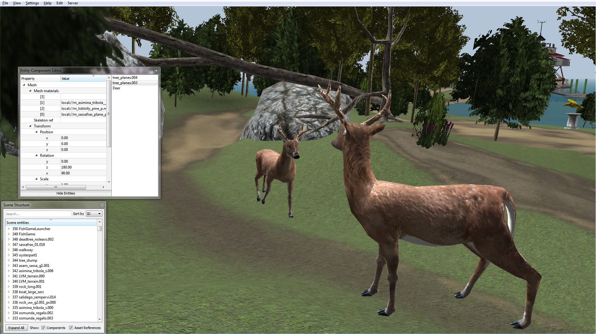

================================================================
realXtend: a platform for realtime 3d and networked applications
================================================================

.. contents::

Description
===========

realXtend is an open source project that develops an application platform,
featuring realtime 3d graphics, efficient networking,
integrated GUI and user input APIs and scripting.
It has been used for virtual meeting environments, collaborative architectural design and multiplayer gaming.

One of the outcomes of the project is the new Tundra SDK, which was released in early
2011. It is a complete solution, on which application development is
very simple. The Tundra SDK is intended for developers who wish to create applications 
that need realtime graphics rendering, possibly combined with networking for e.g. multiuser functionality.

Features
========

Tundra SDK is made by integrating a set of open source libraries in a modular framework.
These provide the basic functionality for 3d, multimedia and networking. 
They are divided in two categories: the core API, and optional modules.

Core API
--------

is always expected to be there:

- Ogre3D for graphics rendering
 * has OpenGL, Direct-X and OpenGL ES renderer plugins
 * widely available support for exporting models from other applications

- QT for UI and exposing the API for scripting (Javascript and Python)

- kNet for networking
 * KristalliNet, or kNet for short, is a new but quite mature library…
 * Supports both UDP and TCP

- OpenAL for audio playback, with 3d spatial audio

Additional modules:
-------------------

There is also a set of optional modules, which typically integrate some open source library to implement additional functionality.
The core framework is used to expose these features for scripting as well, so for example VOIP groups for Mumble can be implemented in application specific Javascript.

Currently available modules include:

- XMPP instant messaging and video calls, using the Telepathy library
- Mumble for in-world voice chat (similar to Teamspeak), combined with OpenAL for spatial audio
- OpenAssetimport - for reading mesh files in other formats, including Collada, Wavefront OBJ and PLY
- CAVE support, by rendering multiple viewports
- Text-to-speech synthesis, using the Festival library
- Separate Javascript (with QtScript) and PythonQt scripting support modules. Lua could be added with QtLua.
- Bullet for physics
 * bullet is an open source rigid body physics library from continousphysics.com
 * is used also in several commercial games
 * is also integrated in Blender
- OpenCV for video camera input and machine vision analysis

The reference documentation for both the Core API and the additional modules included in the central repository is in
http://www.realxtend.org/doxygen/ .

The extensible scene model
--------------------------

The aggregation based scene entity model is described in another article, 
"An Entity-Component Model for Extensible Virtual Worlds",
https://github.com/realXtend/doc/raw/master/arch_article/simple.pdf

In short, it provides the application developer the means to create
custom components, which can then be added to any scene entity. 
That application specific scene data is then automatically
synchronized among all participants in the network, and handled when
saving or loading scenes from files. 

The application can be written in
pure Javascript or Python, but still utilize the powerful C++
libraries such as Ogre and Bullet. Or in C++ using the module system
there. Javascript applications have the great advantage that the code
for them can be downloaded live from the servers, similarily to how
HTML+JS web pages work.

Usage
=====

Applications are authored as documents which describe the static data and refer to the software modules which implement the application specific functionality. This is similar to HTML, where the static data html file can refer to external Javascript files which implement the client side functionality of the web application. The equivalent format for the networked 3d applications in Tundra is called TXML, and there is also a binary serialization format called TBIN.

The platform provides two scene GUI tools for editing the scene: the scene structure window, and the entity-component (EC) editor. The scene window shows all the entities in the scene, and the EC editor shows all the components of the selected entity. This does not differentiate the component types that are available by default and custom components, but they are technically identical in the system so all the basic features work similarily. You can even add new custom components with arbitrary data in the editor, and it then gets automatically synchronized over the network and saved. Figure 1 shows a realXtend demo scene, with these editors open.

   
   A realXtend scene in Tundra, with the scene structure and entity-component editor tools.

At any time, you can save the whole scene state, or part of it, into these file formats for later loading. You can also import multiple scene files into the same scene. The .txml or .tbin files do not need to store whole scenes. You can also store individual scene entities in these files, and later on use a script to instantiate these entities to the world. Tundra does not make a distinction between an object/entity file and a scene file.

Typically, a scene file holds references to several asset files (textures, meshes, etc). Also this is similar to HTML, which supports multimedia via external URI references. Like web browsers, also Tundra can work both with local files and download remote ones with HTTP. To add new 3d models to a scene you can just drag&drop them from the local filesystem or from a web browser. Special applications made on the platform support also adding images, audio and even automatical conversion of powerpoint slides with drag&drop.

In networked settings, the same codebase is used both for running servers and clients. 
For local single user applications Tundra can run standalone. 
You can simply click an a scene file to launch that application.

Example applications
--------------------

There is a growing set of example applications in the code repository, 
see https://github.com/realXtend/naali/blob/tundra/bin/scenes/ .

This video demonstrates several of the basic ones:
http://www.youtube.com/watch?v=Wg6SAQPW-9k

Relevance for multimedia and education
======================================

The Tundra SDK makes developing 3d and/or networked applications
relatively easy, without giving away any of the power. This can be
very useful for research experiments and learning exercises. For
example, one person at the Oulu university technical faculty has built
a CAVE setup and integrated own custom controllers and logic to it in
Python in a few months time, without any previous experience about the
platform or similar technologies. That will be his diploma thesis
work.

Another diploma thesis was completed last year, on the field of
information visualization. In that work the student wrote a module
which automatically creates a 3d scene based on the information about
any given software project. "Visualising Software Projects using
OpenSim Virtual World Server",
http://blog.knowsense.co.uk/blog/_archives/2010/12/20/4707937.html

realXtend combines many media technologies: 3d graphics, 3d spatial
audio, streaming voice over the net (Mumble VOIP), xmpp instant
messaging. Additionally, during spring 2011 developers at Adminotech
are adding new modules for video camera input and augmented reality
functionality (e.g. drawing virtual objects on top of real ones,
selectively). We've also experimented with machine vision based head
tracking, and now using Kinect.

One idea is to use Tundra for teaching programming. The immediacy of
the execution combined with the highly visual outcomes can be a fun
way to learn, similar to how Scratch is used even by small
children. Developing with Javascript in local Tundra works so that can
just edit the code in your favorite editor, save the file when want to
apply the changes, and see the result automatically immediately in the
graphical view which can have open on the side. The asset system
monitors the file system for changes in the files used in the current
scene. Same live reloading works also for 3d models, images and qt ui
files. 
This video demonstrates it with editing the Javascript source of the minimal pong example
while the game is running: http://www.youtube.com/watch?v=ty8LdX80KaE

realXtend is also one of the official platforms of the Immersive Education initiative. 
This video shows a Maryland blue crab in realXtend, Open Wonderland and Sirikata:
SNEAK PEEK : Smithsonian 3D blue crab in 3 virtual worlds
http://www.youtube.com/watch?v=cUKuDnEMuAk&NR=1

Conclusion
==========

realXtend Tundra SDK provides a feature rich toolkit for multimedia
applications. The main purpose is to support networked 3d applications
well. But it is also simple to use for other purposes, for example
just combining local video camera input with some custom control logic
written in javascript in a standalone application. On the other hand,
native code can be used too for example when need custom udp messaging
or efficient 3d geometry processing.

Further information
===================

- example scenes, i.e. Tundra apps written in Javascript:
  https://github.com/realXtend/naali/tree/tundra/bin/scenes

  A video
  of many of these: http://www.youtube.com/watch?v=Wg6SAQPW-9k

- API docs (same for c++ and js and py basically),
  http://www.realxtend.org/doxygen/

- an article, "An Entity-Component Model for Extensible Virtual
  Worlds" was accepted to an upcoming special issue in the IEEE
  Internet Computing magazine on next gen. virtual world
  architectures: https://github.com/realXtend/doc/raw/master/arch_article/simple.pdf . Will be edited still before goes to print, but has
  the info and is clear to read already.

http://realxtend.wordpress.com/2011/05/14/simple-world-authoring-tools/
