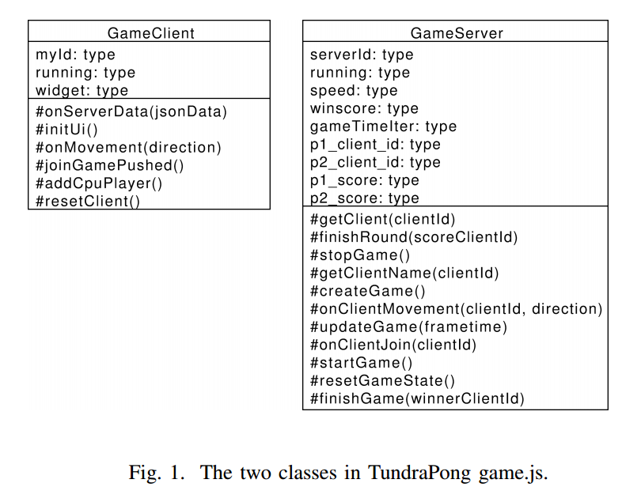
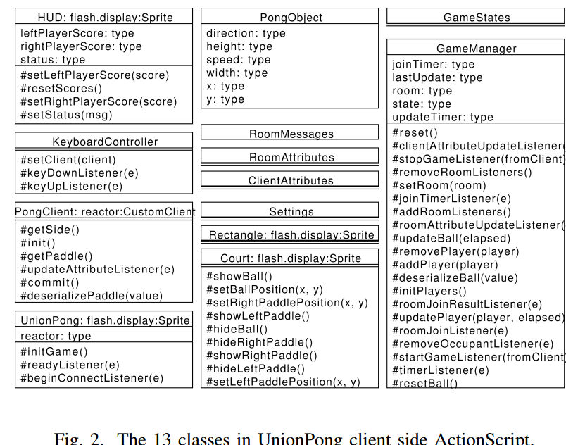
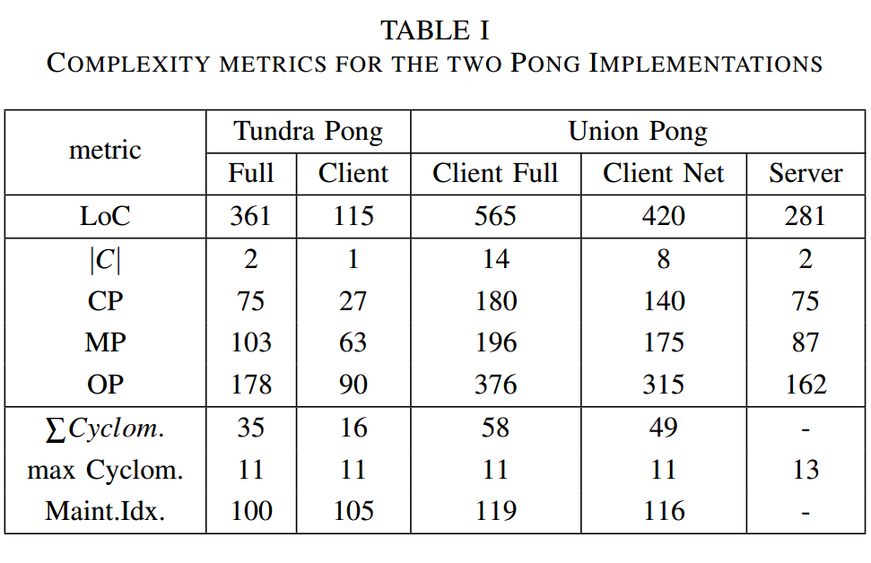

<iframe
width="960" height="585" 
src="http://www.unionplatform.com/?page_id=1229"
style="
//transform:scale(0.5); 
//transform-origin: 0 0;
"/>

<iframe
width="960" height="585" 
src="http://www.unionplatform.com/?page_id=1229"
/>

.. playroom ..

!

**Comparative API Complexity Analysis of Two Platforms for Networked Multiplayer Games using a Reference Game**

<!--
<iframe
width="640" height="390" 
src="http://www.unionplatform.com/?page_id=1229"
style="position: absolute;
top: 0px;
z: -1;
"/>
-->

<em>

* Toni Alatalo, Erno Kuusela, Rauli Puupera, Timo Ojala
  - University of Oulu, Finland
  - Playsign Ltd., Oulu, Finland

</em>

toni@playsign.net

!

Motivation
===

* plenty of libraries for making games, networking and multiplayer games

* how does a developer know what is a good and suitable one?

* how should we develop our API in realXtend.org? (Open Source)

!

Idea: Surrogate Analysis
===

* compare implementations of the same game on different platforms

* previously done with Object Points measurements in *Sobernig et al (2012)*

* here: two pre-existing implementations of **Multiplayer Pong** (minimal case)

<iframe title="YouTube video player" class="youtube-player" type="text/html" 
width="320" height="195" src="http://www.youtube.com/embed/ty8LdX80KaE"
frameborder="0" allowFullScreen></iframe>
<!-- http://www.youtube.com/watch?v=ty8LdX80KaE -->

!

The size / scope diff is clear:

2 vs. 13+ classes

!

SW Complexity
===

!

[refgames.org](http://refgames.org/)
===

* let's collect a good body of data! ..or?

    * [TodoMVC](http://todomvc.com/) from the Web side is inspiring

* more platforms with Pong?
   * Union 2.0, Unity3D + multiplayer plugin, Unreal Engine, now.js, Google's new multiplayer support with Corona SDK, ..

* other game(s), more features?

* quality analysis combined?

!

Thanks!
===

 

--^ [[ ~ ]] ^--(()
 
... . . .. == ||

 
 

.. and do check the <a href="http://www.realxtend.org/">realXtend Tundra SDK</a> & WebTundra demo later.

