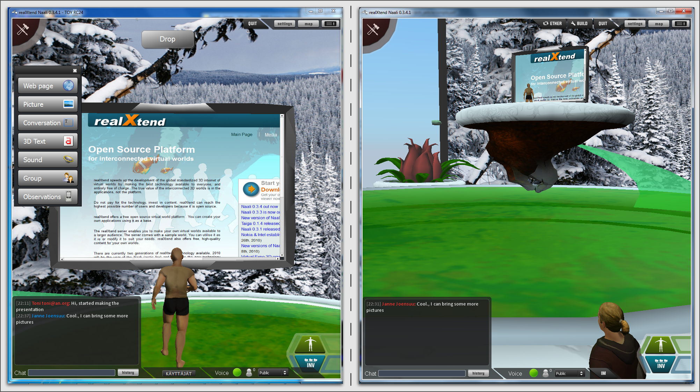

In contrast with the avatar functionality, let's consider an
application without avatars at all. Many virtual worlds and games do
not have a single character as the locus of control: map applications
or astronomical simulations are about efficient navigation and time
control of the whole space, not about moving own presence around.
Game genres like real time strategy (RTS) feature controlling several
units, similarly to board games like chess. To get an even more
different view to the user controls, the example here is not about
navigating a view of a 3d space or spatial movement of units. Instead,
let's design a slideshow like presentation application using the same
entity-component-action building blocks as in the avatar example.

What do we need for a presentation?
-----------------------------------

The presentation tool gives the presenter means to control the
position in the prepared material, for example to select the currently
visible slide in a slideshow. In a local setting where everyone is in
the same physical space, it is simply about choosing what to show via
the overhead projector. In a remote distributed setting, there must be
some system to get a shared view over the network, and that is the use
case in this example.

There are several ways how the realXtend platform could be used to
make a presentation. One is to put the material in the 3D space so
that by navigating the view the presenter can focus on the different
topics. The material could be simply 2D text and image slides, or web
pages, on plates around the space. The 3d space would be a spatial
organization and navigation tool for the traditional slides. Or there
could be animated 3D objects in the scene. Alternatively, the viewport
could stay in place while the scene is changed -- e.g. by simply
changing the slide on a virtual display in world, or by moving
different objects to the view during the course of the
presentation. Also, the platform and the entity-component system is
not limited to the 3D view: the 2D UI is also accessible for
application scripts, so they can use the network synchronized entity
attribute states and actions with 2D widgets. The built-in voice
capability and text chat can be used for the talk and communicating
with the others.

No matter how the presentation view is made, the presenter typically
needs the same controls: the default action to advance to the next
point, and alternatively to reverse back to the previous one or jump
to an arbitrary one. In this example, let's map those to the arrow
keys and the default act of proceeding to the next point also to
spacebar and the left mouse button. Here we diverge from e.g. the
defaults in the Second Life client, where the arrow keys are used to
move and turn the avatar, spacebar makes the avatar jump or start
flying, and the left mouse button over the 3d view triggers the
possible default action on the object in the scene under the mouse
cursor (the avatar touches it). SL is often used for presentations,
but typically so that the default avatar controls stay and in-world
buttons are used to control the slideshow. That is, pressing arrow
keys just rotates or moves your avatar, and you must instead hit the
right 3d object in the scene with a mouseclick to control the
presentation. We argue that customizing the controls to best support
the task at hand is essential. Moreover, the application designer
should be given the choice whether to include avatars or not.

Synchronizing the view, getting the presentation control actually
executed when the presenter presses the keys, is now the remaining
area to be designed. In the distributed system one question is where
to execute what. One option is to handle the controls locally in the
presenter's client: listen to key and mouse input there, manipulate
the scene accordingly and get it shared via the generic scene
synchronization mechanism which is there by default. For example if
the slides are published on the web, the presentation script can just
have a list of URLs and change the current one to be used on a webview
in the scene. When running this locally in the presenter's client, no
server or other participants actually need to know anything about the
presentation -- there is no need for a shared presentation application
among the participants. It is just a custom tool that the presenter
uses to manipulate the basic scene. Both Naali and the Second Life
viewer support showing web pages by default.

However, sharing the custom presentation functionality and the data
among the participants would enable useful features for the
audience. An outline view could highlight the current
position. Participants could browse the material freely in an
additional view beside the one the presenter controls. The visual side
of showing the outline and hilighting the current position there could
be done from the presenter's client, simply by adding more elements to
the shared scene. But it might be simpler when the data is shared, and
certainly for free individual browsing, having the data in each client
is more powerful.

Implementation
--------------

The simplest way to get a shared, synchronized view of the
presentation slides is to use a static camera which shows a single
webpage view. It then suffices for the server to change the current
page on that object for everyone to see it.  We could do this with a
2D widget, but let's use a 3D scene to illustrate the extensibility
there.

So, let's add a new entity called "presentation". For showing web
pages, we need a few basic components: Placeable to have something in
the scene, Mesh to have geometry (e.g. a plane) on which to show the
slides, and WebView to render html from URLs. And two additional ones
for our custom functionality: a DynamicComponent for custom data, and
a Script to implement the UI and presentation controls. As data we
need a list or URLs and an index number for the current position. This
custom data becomes part of the scene data and is automatically stored
and synchronized among the participants. The Script component is a
reference to Javascript or Python code which implements all the logic.

To handle the user input, we have two options: either handle input
events and modify the state correspondingly directly in the client
code, or send remote actions like in the avatar example. Let's use
remote actions again so can use the server as a broker for security,
and to get a similar design to compare with the avatar example. So
client side code maps right-arrow and spacebar keys to
SetPresentationPos(index+1) etc. Server can then check if the caller
has permissions to do that action, for example in presentation mode
only the designated presenter is allowed to change the shared
view. Then if the presentation material is left in the scene for
visiting later, control can be freed for anyone. The index attribute
is synchronized for all participants so the outline GUI can update
accordingly.

For the outline view, the code can add a 2D panel with thumbnails of
all the slides and hilight the current one. For free browsing,
clicking on a thumbnail can open a new window with that slide, while
the main presentation view remains. This we way have a simple,
complete presentation application implemented on top of a generic
virtual world platform.

Does this make sense?
---------------------

Of course just getting a shared view of a set of web pages could is
easily deployed without realXtend technology just by using regular web
browsers with HTML, Javascript and some server backend. The idea here
is to illustrate the use of ECs and automatic attribute
synchronization for custom functionality in a minimal complete
example. Real benefits of the platform would be utilized if the actual
presentation material was interactive animated 3D objects, such as
alternative house or car designs, which the presenter would go through
and manipulate during the talk. Basically what we are aiming at is
making interactive multi-user 3D applications easy to author,
comparable to how single user web pages are today.

It is, however, interesting to consider whether the platform makes
implementing this kind of features so easy that it makes sense for
things that could work in regular web browsers. This is relevant also
because we are writing an experimental WebNaali client which does
entity attribute sync and actions over WebSockets. For 3D view it uses
WebGL, but for 2D applications the networking part could be used
without WebGL as well. 

   Two Naali clients by the presentation stage of the TOY system, an
   open source learning environment for the Future School of Finland
   project. The one on the left just added a web page to the stage,
   and is currently carrying the object.
