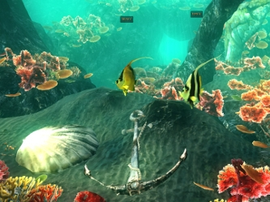

======================
Worlds on Your Desktop
======================
----------------------------------------------------
simple yet powerful extensibility for virtual worlds
----------------------------------------------------

*What if you could edit a visually appealing and highly interactive
virtual world just like you edit traditional files? Change them
locally, save multiple versions, then publish them on the net as
shared environments where anyone can log in? Add your own custom data
and functionality using familiar scripting languages? You can already
do all of this, using fully open source software.*

(This document was generated on |date| at |time|.)

.. |date| date::
.. |time| date:: %H:%M

.. contents::

Introduction
============

RealXtend is an open source project aiming to speed up the development
of standards for 3D virtual worlds. We leverage standards including
HTTP, COLLADA, XMPP and open source libraries such as OGRE 3D, Qt,
OpenSimulator, and Blender.  Beginning as a collaboration of several
small companies that utilize the base technology in different
application fields, but which coordinate the development of the common
code base together. This has culminated in a new virtual world
application called Naali, the Finnish word for the arctic fox,
referring to the Finnish origins of the project and the goal to make a
generic platform for virtual worlds akin to Firefox for HTML-based
applications.

For users with no previous experience in virtual worlds, 3D or game
programming, the tool allows easy reuse of premade models and scripts
from libraries on the web. Any asset reference in realXtend can be an
URL, and the Naali GUI supports simple drag&drop of 3D models from web
pages to the 3D scene. A virtual world can be snapped together like
Lego bricks, instantly viewed, its a simple and fun process for users
of all ages. Editing can be done locally, and the creation published
later. This is in contrast to Second Life (tm) (SL) where all edits
and additions happen on the servers -- the client application being
no more than an interface to server side functionality.

Naali is a single application that can run completely standalone, and
does not suffer from the complexity of setting up a separate server
with databases for local editing. With OpenSimulator people often run
a SL compatible server locally to achieve this local building
[opensim-on-a-stick]_. Developers will find Naali to be highly
extensible with dynamically loadable/unloadable modules.  For example,
an entirely new scripting language could be loaded as a module without
needing to recompile Naali. Naali uses the Apache license so is
permissive for businesses to create commerical software based on it.
In contrast again to the Second Life viewer which only recently was
relicenced partially from GPL to LGPL, with a single company owning
and controlling the copyright. The main point of this article,
however, is independent of particular applications, but instead about
the extensible scene model we have now started using.

Naali uses the so-called Entity-Component (EC) model as a basis to
construct extensible scenes. The model was adopted from contemporary
game engine architectures [ec-links]_. Entities are simply unique
identitities, with no data or typing. They aggregate components, which
can be of any type and store arbitrary data. Applications built using
Naali can add their own components to have the data they need for
their own functionality. The code that handles the data exists in
preinstalled custom modules or in scripts loaded at runtime as a part
of the application data.

The Naali platform provides the basic functionality for all ECs:
persistence, network synchronization among all the participants via a
server and a user interface for manipulating components and their
attributes.  In addition, Naali introduces a new concept called
"Entity Actions", which are a simple form of remote procedure call
(RPC). These are demonstrated in two examples later in this article.

A scene is defined by the entities it has -- there is nothing
hardcoded about them at the platform level. This differs essentially
from the current OpenSimulator paradigm when using the SL protocol --
where the model is largely predefined and hardcoded in the platform:
there always is a certain kind of a terrain, a sky with a sun, and
each client connection gets an avatar to which the controls are mapped
[VWRAP]_. We argue that there is no need to embed assumptions about
the features of the world in the base platform and protocols.

There already exists many examples that prove our point, one is the
open source Celestia universe simulator that does not have any
hardcoded land or sky.  Naali is a true platform that does not get in
the way of the application developer; they can create anything from a
medical simulator for teachers, to action packed networked games - and
always with a custom interface that excatly fits the application's
purpose. Rather then being in control of a single avatar, you can for
example create a world where the user is an entity controlling the
weather conditions of the whole environment, and make a game around
that. 

All these can work on top of the same generic software platform and
network protocol, similarily to how web sites feature different
functionality and interfaces that run in the generic browsers. Just
that here the client has the most powerful native 3d graphics engine,
and the realtime protocol can use UDP to minimize latency when
needed. Yet writing custom functionality is made easy with Javascript
and Python, which can access the 3d side of things like skeletal
animation control.

To demonstrate the feasibility of our generic approach, there is a
growing set of application examples in the Naali example scenes
directory available on GitHub [naali-scenes]_. We present two of them
below to illustrate how the EC model works in practice. First there is
an implementation of a SL-like avatar, implemented using a set of
pre-existing generic ECs and specific Javascript code that run both on
the server and the clients.  The second example is a simple
presentation application where we use custom data to share the
presentation outline for all participants, and to let the presenter
control the view for the others as the presentation proceeds.

Making of Avatars
=================

.. include:: avapp.rst

A Simple Presentation Tool
==========================

.. include:: presapp.rst

Discussion
==========

Related work
------------

We are certainly not the first to propose genericity to virtual world
base architectures. For example in the NPSNET-V work, extreme
extensibility is achieved by the whole system being built around a
minimal microkernel on which arbitrary code can be added at runtime
using the mechanisms in the Java virtual machine [NPSNET-V]_. A
contemporary example is the Meru architecture from the Sirikata
project, where a space server only knows the locations of the
objects. Separate object hosts, either running on the same server or
any client / peer, can run arbitrary code to implement the objects in
the federated world [sirikata-scaling]_. Messaging is used exclusively
for all object interactions [sirikata_scripting]_. The idea with the
Entity-Component mechanism in Naali is, instead, to lessen the need to
invent own protocols for all networked application behaviour when for
simple usage using the automatically synchronized attributes
suffices. In preliminary talks with some Sirikata developers we
concluded that they want to keep base level clean from such high level
functionality, but that things like the attribute autosync would be
desireable in application level support scripts.

The aggregation, not inheritance, using EC model was adopted from game
engine literature [ec-links]_. Running the same Javascript code
partially both on the server and clients is basically identical to a
gaming oriented virtual world platform called Syntensity
[syntensity]_.  Also in Syntensity developing custom functionality is
enabled by defining own entity types, and declaring what so-called
StateVariables each such entity has. These StateVariables are then
automatically synchronized to all participants, they are basically
identical with the Naali EC attributes. The Naali implementation is
inspired by the Syntensity one, which we studied early on. The
difference is that in Syntensity the entities exists on the scripting
level only, and the basic functionality like object movements is
hardcoded in the Sauerbraten/Cube2 platform which was originally built
for a first person shooter game. In Naali everything is now made with
the ECs only, so the same tools work for e.g. graphical editing,
persistentence and network sync identically for all data.

The document oriented approach of having worlds as files is of course
precedented in 3D file format standards like VRML, X3D and
COLLADA. Unlike those, the realXtend files do not have 3D geometry,
but describe a scene by referring to external assets, for example
meshes in the COLLADA format. Essentially they are a mechanism for
also application specific custom data, which is automatically
syncronized over the net. They have script references that implement
the functionality of the applications, similar to how HTML documents
have Javascript references. But also this is not specified in the file
format, it is just how the bundled Script component works. 

.. (W.I.P NOTE: check how x3d and friends do scripting).

The realXtend platform is currently by no means a complete solution
for all the problem of virtual world architectures. Naali does not
currently address scaling at all, nor is federated content from
several possible untrusted sources supported. We started by having
power in the small scale, ability to easily make rich interactive
applications. In the future, we look forward to continuing
collaboration with e.g. the OpenSimulator and Sirikata communities to
address the trust and scalability issues. Opensim is already used to
host large grids by numerous people, and the architecture in Sirikata
seems promising for the long run [sirikata-scaling]_.

.. (add about the javascript sandbox challenge here? standardizing client side APIs?)

Status of implementations
-------------------------

The generic Entity-Component approach was proposed to OpenSimulator
core and accepted as the plan already in December 2009
[adam-ecplan]_. The implementation is however still in very early
stages, only the first steps have been taken to allow refactoring the
framework be generalized and the re-implementation of current features
as ECs by optional modules. It can be used, however, with the Naali
client application when running against Opensim using the realXtend
add-on module (the combination of opensim+modrex is called
Taiga). This works in a limited fashion, as the Second Life protocol
and OpenSim internals still assume the hardcoded SL model, but you can
still add arbitrary client side functionality and have the data
automatically stored and synchronized over the net via OpenSimulator.

The generic application platform works currently fully when using the
so called Tundra server, which a simple server module added to Naali
itself [tundraproject]_. This allows Naali to run as standalone for
local authoring, or for single user applications, but also for using
it as a server to host worlds on the net instead of using
OpenSimulator. With Tundra LLUDP is no longer used, but all basic
functionality is achieved with the generic EC synchronization. For the
transport layer, we are using a new protocol called kNet which can run
either on top of UDP or TCP [knet]_. kNet is similar to eNet but
performed better in tests with regards to flow control. The Tundra
server lacks many basic features and may never get some of the
advanced OpenSimulator features, like running untrusted user authored
scripts and combining multiple regions to form a large grid. Tundra is
however is already useful for local authoring and deploying
applications like simple games to production use. And it serves as an
example of how a generic approach to allow virtual worlds
functionality can be simple yet practical.

Regarding the status of the Naali application overall, it is maturing
and has already been deployed to customers by some of the development
companies. It is a quite straightforward modular C++ application with
optional Python and Javascript support. Qt object metadata system is
utilized to expose the C++ internals automatically. This covers all
modules like the renderer and the UI, and all the ECs. The QtScript
library provides this for Javascript support, and PythonQt does the
same for Python. There is also QtLua with which Lua support could be
easily added. Thanks to the Ogre3D graphics engine, Naali runs both on
e.g. the N900 mobile phone with OpenGL ES, and on powerful PCs with
multiple video outputs with the built-in CAVE rendering support. There
is also an experimental WebNaali client, written in Javascript to run
in a web browser, doing the EC sync over WebSockets and rendering with
WebGL.

The most severe missing piece in our current EC synchronization is the
lack of security, for example a permission system. A first
implementation is probably made soon to cover the basics, similarily
to how Syntensity already has attributes that can only change if the
server allows.

Conclusion
==========

We have demonstrated how a generic approach to virtual worlds can be
simple and practical, yet powerful and truly extensible. We hope this
is taken into consideration in upcoming standardization processes, for
example if VWRAP proceeds to address in-world scene functionality. In
any case, we will continue to develop the platform and applications on
top of it. Anyone is free to use it for their needs, and to
participate in the development which is mostly coordinated on-line.

References
==========

.. [NPSNET-V] Andrzej Kapolka, Don McGregor, and Michael Capps. 2002. A unified component framework for dynamically extensible virtual environments. In Proceedings of the 4th international conference on Collaborative virtual environments (CVE '02). ACM, New York, NY, USA, 64-71. DOI=10.1145/571878.571889 http://doi.acm.org/10.1145/571878.571889 

.. [opensim-on-a-stick] http://becunningandfulloftricks.com/2010/10/07/ a-virtual-world-in-my-hands-running-opensim-and-imprudence-on-a-usb-key/

.. [naali-scenes] https://github.com/realXtend/naali/blob/tundra/bin/scenes/

.. [tundra-avatar] Application XML and usage info at https://github.com/realXtend/naali/tree/tundra/bin/scenes/Avatar/ , Javascript sources in https://github.com/realXtend/naali/tree/tundra/bin/jsmodules/avatar/

.. [adam-ecplan] Adam Frisby on Opensim-dev, Refactoring SceneObjectGroup - Introducing Components. The plan PDF is attached in the email, http://lists.berlios.de/pipermail/opensim-dev/2009-December/008098.html

.. [VWRAP] Joshua Bell, Morgaine Dinova, David Levine, "VWRAP for Virtual Worlds Interoperability," IEEE Internet Computing, pp. 73-77, January/February, 2010 

.. [sirikata-scaling] Daniel Horn, Ewen Cheslack-Postava, Tahir Azim, Michael J. Freedman, Philip Levis, "Scaling Virtual Worlds with a Physical Metaphor", IEEE Pervasive Computing, vol. 8, no. 3, pp. 50-54, July-Sept. 2009, doi:10.1109/MPRV.2009.54 http://www.cs.princeton.edu/~mfreed/docs/vworlds-ieee09.pdf

.. [sirikata_scripting] Bhupesh Chandra, Ewen Cheslack-Postava, Behram F. T. Mistree, Philip Levis, and David Gay. "Emerson: Scripting for Federated Virtual Worlds", Proceedings of the 15th International
   Conference on Computer Games: AI, Animation, Mobile, Interactive
   Multimedia, Educational & Serious Games (CGAMES 2010 USA).
   http://sing.stanford.edu/pubs/cgames10.pdf

.. [ec-links] Mick West, Evolve Your Hierarchy -- Refactoring Game Entities with Components http://cowboyprogramming.com/2007/01/05/evolve-your-heirachy/

.. [syntensity] http://www.syntensity.com/

.. [knet] http://bitbucket.org/clb/knet/

.. [tundraproject] http://realxtend.blogspot.com/2010/11/tundra-project.html
