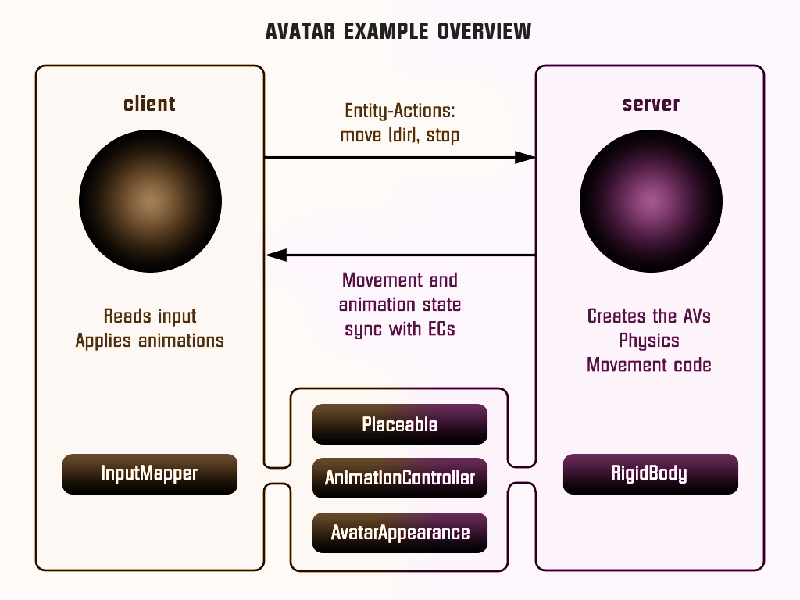

================================================
Extensibility Architecture for 3D Virtual Worlds
================================================
----------------------------------------------------

*What if you could edit a visually appealing and highly interactive
 virtual world just like you edit traditional files? Change them
 locally, save multiple versions, then publish them on the net as
 shared environments where anyone can log in? Cut-and-paste scene data
 from the Web or add your own custom data and functionality using
 familiar scripting languages?  You can already do all of this using
 the open source realXtend platform.*

(This document was generated on |date| at |time|.)

.. |date| date::
.. |time| date:: %H:%M

.. contents::

Introduction
============

Over the past several years, the realXtend project has developed a
freely available open source virtual world platform that let’s anyone
create their own applications using it’s platform as a base.
RealXtend began as a collaboration of several small companies that
coordinated in developing a common technology base that they then
applied in different application fields including virtual worlds,
video games, educational applications.

Like several other 3D virtual world platforms, the realXtend project
has take a client-server approach.  A browser-like client called a
viewer renders content enabling end users to see and manipulate a 3D
window into a virtual world where the content itself is stored and
shared on a (typically remote) server.  The realXtend project has
developed an open source viewer called Naali, the Finnish word for the
arctic fox, referring to the Finnish origins of the project and also a
reference to the open source Firefox web browser because it aims for
similar wide-spread availability as a browser for virtual worlds.  The
Naali viewer can connect to Second Life (SL), Open Simulator, or
realXtend’s own Tundra server.  It can run on Windows, Ubuntu and
several mobile platforms.
  
One goal of the realXtend project has been to build entirely on open
standards and open source software to remove the roadblock of
proprietary software and pave the way for 3D virtual worlds to become
widely used.  To this end, Naali and Tundra make use of HTTP, COLLADA,
XMPP and open source software such as OGRE 3D, Qt, OpenSimulator, and
Blender.  An immediate benefit can be seen in that realXtend supports
a widely used graphics standard, COLLADA.  Where Second Life (the most
widely used but proprietary 3D virtual world) has strict limitations
on importing or exporting 3D virtual world content and supports a
proprietary representation called prims (primitive graphical objects),
both of which making sharing or preserving assets difficult, realXtend
has made it easy to import or export content.  The tool allows reuse
of existing models and scripts from libraries on the web. Any model
asset in realXtend can be included in a scene via a URL reference, and
the Naali graphical user interface supports drag-and-drop of 3D models
from web pages like Google 3D Warehouse to the 3D virtual world
scene. In realXtend, a virtual world can be snapped together from
existing components like Lego bricks, and instantly viewed.
 
Another goal of realXtend is flexible editing of virtual worlds --
editing can be done locally, and the creation published later. This is
in contrast to Second Life where all edits and additions happen on
remote servers -- the client application being no more than an
interface to server side functionality. Naali coupled with Tundra or
OpenSimulator can run completely standalone, without the complexity of
setting up a separate server for local editing [opensim-on-a-stick]_.

A final architectural goal of our project is extensibility - the
ability to dynamically add or remove functionality to a virtual world
platform to meet the needs of specific applications.  Our
extensibility architecture is the focus of the rest of this paper.

Extensible Scene Architecture
=============================

Independent of any particular virtual world viewer and server
implementation, we can define an extensible scene model.  A scene is
defined by the entities it has -- there is nothing hardcoded about
them at the platform level.  This differs essentially from the current
OpenSimulator paradigm when using the SL protocol where the model is
largely predefined and hardcoded into the platform: so, in SL, there
is always a certain kind of terrain, a sky with a sun, and each client
connection gets an avatar to which the controls are mapped
[VWRAP]_. We argue that there is no need to embed assumptions about
the features of the world in the base platform and protocols.

Our Naali viewer uses an Entity-Component-Action (ECA) model as a
basis to construct extensible scenes.  The model was adapted from
contemporary game engine architectures [ec-links]_. Entities are
unique identities, with no data or typing. They aggregate components,
which can be of any type and store arbitrary data. Applications built
using Naali can add their own components to have the data they need
for their own functionality. The code that handles the data exists in
preinstalled custom modules or in scripts loaded at runtime as a part
of the application data.

The Naali platform provides basic functionality for all ECAs:
persistence, network synchronization among all the participants via a
server and a user interface for manipulating components and their
attributes, (and eventually will support security).  In addition,
Naali introduces a new concept called “entity actions,” a simple form
of remote procedure call. The ECA architecture is demonstrated in two
examples later in this article.

To demonstrate the feasibility of this generic scene modeling
approach, we are using Naali to develop a growing collection of
example scenes in a directory available on GitHub
[naali-scenes]_. Below, we present two of them to illustrate how the
ECA model works in practice In the first example, we implement a
SL-like avatar using a set of pre-existing generic ECAs and specific
JavaScript code that run both on the server and the clients. The
second example is a presentation application that lets a presenter
control the view for the others as the presentation proceeds.

Avatars are not part of the platform
====================================

Avatars are graphical representations of the user within the virtual
world.  It may seem at first that the concept of an avatar is integral
to 3D virtual worlds.  Second Life’s avatar protocol is hardcoded into
the platform.  Yet, many virtual worlds, simulation platforms, and
games do not have a single character as the locus of control: for
instance, map applications or astronomical simulations are about
efficient navigation and time control of the whole space, not about
moving one’s presence around.  Game genres like real time strategy
games feature controlling several units, similar to board games like
chess.  Thus, we argue instead that avatars should not exist as part
of the base platform because many simulations do not require them.  Of
course, a generic platform must still allow the implementation of
avatar add-in functionality. Below we describe a proof of concept
implementation of avatars as add-ins using the realXtend ECA model.
The full source code is available at [tundra-avatar]_.

   The architecture of the avatar example uses a client (brown), a server (purple), 
   arrows representing network messages, and filled boxes representing ECAs on the client, 
   server or shared by both.

Avatar functionality is split in two parts: The first part governs the
visual appearance and related functionality to modify the looks and
clothing, and the use of animations for communication. The second part
models insures that every user connection is given a single entity as
the point of focus and control. The default inputs from arrow keys and
the mouse are mapped to move and rotate the avatar. In this
discussion, while we cover the basics of avatar appearance, the focus
is on the latter control functionality.

The server-side functionality to give every new client connection a
designated avatar is implemented in a JavaScript
(avatarapplication.js, see code below).  Upon a new connection, this
script creating a new Avatar entity and these components: EC_Mesh for
the visible 3D model and an associated skeleton for animations;
EC_Placeable for the entity to be positioned in the 3D scene;
EC_AnimationController to change and synchronize the animation states;
and EC_Script to implement the functionality of a single avatar.  A
similar script is executed on the client, where it adds two additional
components: a new camera which follows the avatar and a keybinding to
toggle between camera modes.

.. code-block:: javascript

   function serverHandleUserConnected(connectionID, userconnection) {
       var avatarEntity = scene.CreateEntity(scene.NextFreeId(), 
                          ["EC_Script", "EC_Placeable", "EC_AnimationController"]);
       avatarEntity.Name = "Avatar" + connectionID;
       avatarEntity.Description = userconnection.GetProperty("username");
       avatarEntity.script.ref = "simpleavatar.js";

       // Set random starting position for avatar
       var transform = avatarEntity.placeable.transform;
       transform.pos.x = (Math.random() - 0.5) * avatar_area_size + avatar_area_x;
       transform.pos.y = (Math.random() - 0.5) * avatar_area_size + avatar_area_y;
       transform.pos.z = avatar_area_z;
       avatarEntity.placeable.transform = transform;
   }

A second script for an individual avatar (simpleavatar.js) adds
additional components: AvatarAppearance for the customizable looks,
RigidBody for physics; and, on the client side, an InputMapper for
user input. Entity actions are used to make the avatar move according
to the user controls. These actions are commands that can be invoked
on an entity, and executed either locally in the same client or
remotely on the server, or on all connected peers. For example, the
local code sends the action "Move(forward)" to be executed on the
server when the up-arrow is pressed on the client. The built-in
EC_InputMapper component provides triggering actions based on input,
so the avatar code only needs to register the mappings it wants. The
server maintains a velocity vector for the avatar and applies physics
for it. Using ECA attributes, the resulting position is in the
transform attribute of the component Placeable is automatically
synchronized with the generic mechanism so the avatar moves on all
clients. The server also sets the animation state to either "Stand" or
"Walk" based on whether the avatar is moving. All participants run
common animation update code to play back the walk animation while
moving, calculating the correct speed from the velocity data from the
physics on the server.  The following code shows the common code for
updating animations that is executed both on the client and the
server:

.. code-block:: javascript

    function commonUpdateAnimation(frametime) {
        var animcontroller = me.animationcontroller;
        var animname = animcontroller.animationState;
        if (animname != "")
            animcontroller.EnableExclusiveAnimation(animname, true, 0.25, 0.25, false);
        // If walk animation is playing, adjust speed according to the rigidbody velocity
        if (animcontroller.IsAnimationActive("Walk")) {
            // Note: on client the rigidbody does not exist, 
            // so the velocity is only a replicated attribute
            var vel = me.rigidbody.linearVelocity;
            var walkspeed = Math.sqrt(vel.x * vel.x + vel.y * vel.y) * walk_anim_speed;
            animcontroller.SetAnimationSpeed("Walk", walkspeed);
        }
    }

These two parts are enough to implement basic avatar functionality
using the ECA model. This proof of concept implementation totals in
369 lines of JavaScript code in two files. The visual appearance comes
from a pre-existing AvatarAppearance “component,” which reads an xml
description with references to the base meshes used and individual
morphing values set by the user in an editor. Implemented in C++, it
uses the realXtend avatar model from an earlier realXtend prototype
which did not have the ECA model, but is re-used in this demo as is. A
more generic and customizable appearance system could be implemented
with the ECAs, but that is outside the scope of the demo and
description here.

It is worth noting that the division of work between the clients and
the server described here is not the only one possible. We use the
same code to run both the server and the clients, making it simple to
reconfigure what is executed where. This model of clients sending
commands only and the server doing all the movement is identical to
how the Second Life protocol works. It is suitable when trust and
physics are centralized on a server. A drawback is that user control
responsiveness can suffer from network lag.  In the future, we plan to
include the physics module in the client as well as the server to
allow movement code to run locally as well.

With the ability to run custom code also in the client, it is easy to
extend avatar related functionality. For example, in one project for
schools, we added the capability for avatars to carry objects around
as a simple means for 3D scene editing. Another possibility is to
further augment the client with more data that is synchronized for
animations, for instance, the full skeleton for motion capture or
machine vision based mapping of the real body to the avatar pose.

A Collaborative Presentation Tool
=================================

To demonstrate an entirely different use of the ECA framework, we
consider an application that, in its simplest form, implements
collaborative presentations where one user controls sequencing through
a collection (of web pages or PowerPoint slides) while other viewers
watch.  The presentation tool gives the presenter the means to control
the position in the prepared material, for example to select the
currently visible slide in a slideshow. In a local setting where
everyone is in the same physical space, it is simply about choosing
what to show via the overhead projector.  In a remote distributed
setting, there must be some system to get a shared view over the
network, and that is the use case in this example.

A shared, collaborative view of a set of 2D web pages could be
implemented without realXtend technology by using regular web browsers
with HTML, Javascript and some backend server logic.  Our goal here is
to illustrate the use of the ECA model and automatic attribute
synchronization for developing custom functionality.  In a minimal
implementation of shared collaborative presentations, we can use ECA
without using avatars or geography.  Alternatively, because it is easy
to do, we could add those components back in to build shared
presentations like the one in Figure 2 where different avatars see the
presentation from different view points.  [We could go further and
consider a situation where we added multiple views for the
presentation, like slide view and outline view, or where we animate
the presentation content or where we add voice and text chat
components used for communicating with other viewers or to add
annotations to the presentation -- but for simplicity’s sake, we will
keep our application simple.]

Figure 2: Two Naali clients stand nearby and view the presentation
stage of the TOY system, an open source learning environment for the
Future School of Finland project. The one on the left just added a web
page to the stage, and is currently carrying the object.

No matter how the presentation view is made, the presenter typically
needs the same controls.  In Second Life, avatar controls are fixed
and, to control a presentation, one might need to create a
presentation sequence object with mouse click controls to press
virtual buttons.  Because realXtend’s ECA model can support an
EC_InputMapper component in the presenter’s viewer, avatar controls
can be customized for the presentation without introducing an
intermediary object or without the server or other viewers needing to
know anything about control of the presentation.  Alternatively,
sharing the presentation control functionality and the data among the
participants would enable useful features for the audience. An outline
view could highlight the current position. Participants could follow
the presentation in an outline viewer or could browse the material
freely in an additional view next to the one the presenter controls.

Regarding the implementation in realXtend ECA, the simplest way to get
a shared, synchronized view of the presentation slides is to use a
static camera which shows a single webpage view. It then suffices for
the server to change the current page on that object for everyone to
see it. We could do implement in ECA with a 2D widget, but let's use a
3D scene to illustrate the extensibility.

So, we add a new entity called Presentation. For showing web pages, we
need a few basic components: EC_Placeable to have something in the
scene; EC_Mesh to have geometry (e.g. a plane) on which to show the
slides; and WebView to render HTML from URLs. Let’s add two additional
components for our custom functionality: a EC_DynamicComponent for
custom data, and an EC_ Script to implement the user interface
presentation controls.  As data, we need two attributes: a list of
URLs and an index number for the current position. This custom data
becomes part of the scene data and is automatically stored and
synchronized among the participants. The EC_Script component is a
reference to Javascript or Python code which implements the logic.

To handle the user input, we have two options: either handle input
events and modify the state correspondingly directly in the client
code, or send remote actions like in the avatar example. Let's use
remote actions again so we can use the server as a broker for
security, and to get a similar design to compare with the avatar
example. So client side code maps right-arrow and spacebar keys to
“SetPresentationPos(index+1)” etc.  The server can then check if the
caller has permissions to do that action, for example in presentation
mode, only the designated presenter is allowed to change the shared
view. Then if the presentation material is left in the scene for later
use, control can be freed for anyone. The index attribute is
synchronized for all participants so the outline GUI can update
accordingly.  To add an outline view, we could can add a 2D panel with
thumbnails of all the slides and highlight the current one.  For free
browsing, clicking on a thumbnail can open a new window with that
slide, while the main presentation view remains.

Thus, we have a simple, complete presentation application implemented
on top of a generic ECA model virtual world platform architecture.

Related work
============

Simulations have long demonstrated that avatars and geography are not
always required -- the open source Celestia universe simulator
(http://www.shatters.net/celestia) let’s users view 100,000 stars but
does not have any hardcoded land or sky.  Nor are we the first to
propose a generic component model for virtual world base
architectures. For example, the NPSNET-V system is a minimal
microkernel on which arbitrary code can be added at runtime using the
the Java virtual machine [NPSNET-V]_.  A contemporary example is the
meru architecture from the Sirikata project, where a space server only
knows the locations of the objects. Separate object hosts, either
running on the same server or any client / peer, can run arbitrary
code to implement the objects in the federated world
[sirikata-scaling]_. Messaging is used exclusively for all object
interactions [8,9]. The idea with the Entity-Component mechanism in
Naali is, instead, to lessen the need to invent particular protocols
for all networked application behavior when, for many simple cases,
using automatically synchronized attributes suffices. In preliminary
talks with some Sirikata developers, we concluded that they aimed to
keep the base level clean from high level functionality, but that
capabilities like attribute synchronization would be desirable in
application level support scripts.

The Naali EC model borrows the idea of using aggregation and not
inheritance from the game engine literature, specifically a gaming
oriented virtual world platform called Syntensity
[syntensity]_. Syntensity runs the same JavaScript code both on the
server and clients [syntensity]_.  In Syntensity, you compose entities
by declaring what state variables they have. The data is then
automatically synchronized among all participants. The Naali
implementation is inspired by Syntensity. The difference is that in
Syntensity the entities exists on the scripting level only, and basic
functionality like object movements is hardcoded in the
Sauerbraten/Cube2 first person shooter platform. In Naali, all higher
level functionality is now implemented with the ECs, so the same tools
work for e.g. graphical editing, persistence and network sync
identically for all data.

The document-oriented approach of having representing worlds
externally as files has precedents in 3D file format standards like
VRML, X3D and COLLADA. Unlike those, the realXtend files do not
directly include 3D geometry, but describe a scene using URL
references to external assets, for example meshes in the COLLADA
format. Essentially, these files describing scenes are a mechanism for
application-specific custom data, which is automatically synchronized
over the net. They have script references that implement the
functionality of the applications, similar to the way HTML documents
contain JavaScript references. This is not specified in the file
format; instead, it is how the bundled Script component works.

.. W.I.P NOTE: check how x3d and friends do scripting.

Status of the realXtend implementations
=======================================

There are currently two generations of realXtend technology
available. An original viewer (GPL license) still had more features,
while the newer Naali viewer (built-from scratch viewer available
under the Apache 2 license) is the more modular and extensible
platform.  Taiga (which combines Naali and OpenSimulator) is a
continuation and refinement of the original server project (BSD
license).

Regarding the status of the Naali viewer, it is maturing and has
already been deployed to customers by some of the development
companies. It is a straightforward modular C++ application with
optional Python and JavaScript support. The Qt object metadata system
is utilized to expose the C++ internals automatically. This covers all
modules including the renderer and user interface as well as all the
ECs. The QtScript library provides this for Javascript support, and
PythonQt does the same for Python. There is also a QtLua so Lua
support can be added. Thanks to the Ogre3D graphics engine, Naali runs
both on e.g. the N900 mobile phone with OpenGL ES, and on powerful PCs
with multiple video outputs with the built-in CAVE rendering
support. There is also an experimental WebNaali client, written in
Javascript to run in a web browser, doing the EC synchronization over
WebSockets and rendering with WebGL.

Regarding the status of the generic EC architecture, this is
implemented in Naali and also in our Tundra virtual world server
application, which a simple server module added to Naali itself
[tundraproject]_. This configuration enables Naali to run standalone
for local content authoring or for single user applications, but it
can also be used as a server instead of using OpenSimulator.  With
Tundra, LLUDP is not used; instead, all basic functionality is
achieved with the generic EC synchronization.  For the transport, we
use a new protocol called kNet which can run on top of either UDP or
TCP [knet]_.  kNet is similar to eNet but performed better in tests with
regards to flow control. The Tundra server lacks many basic features
of the more advanced OpenSimulator, like running untrusted user
authored scripts and combining multiple regions to form a large
grid. However, Tundra is already useful for local authoring and
deploying applications with custom functionality. And it serves as an
example of how a generic EC approach to virtual worlds functionality
can be simple yet practical.

The generic EC architecture was proposed to the OpenSimulator core and
accepted as the plan of record in December 2009 [adam-ecplan]_.  The
implementation of EC for OpenSimulator is still in the early
stage. However, EC can be demonstrated with the Naali client
communicating with the OpenSimulator (or Second Life) servers in a
limited fashion, as these servers still assume the hardcoded SL model,
but developers can add arbitrary client side functionality and have
the data automatically stored and synchronized over the net via
OpenSimulator.

The realXtend platform does not yet solve all problems related to
virtual world architectures. Naali does not currently address scaling
at all, nor is federated content from several possible untrusted
sources supported. We started by having providing power at the small
scale to provide the ability to easily make rich interactive
applications.  Another important missing element in our current EC
synchronization architecture is security, e.g., a permission
system. An initial implementation is planned to cover the basic
capabilities, similar to how Syntensity already has attributes that
can only change only if the server allows.  In the future, we look
forward to continuing collaboration with e.g. the OpenSimulator and
Sirikata communities to address the trust and scalability
issues. OpenSimulator is already used to host large grids by numerous
people, and the architecture in Sirikata seems promising for the long
run [sirikata-scaling] [sirikata-scaling2].

.. javascript sandbox challenge here?

.. standardizing client side APIs?

Conclusion
==========

In this paper, we described the realXtend project and focused
especially on its Entity-Component architecture which provides a
general extensibility mechanism for building 3D virtual worlds.  The
Naali viewer, which is built using the EC model, is a true platform
that does not get in the way of the application developer; they can
create anything from a medical simulator for teachers, to action
packed networked games - and always with a custom interface that
exactly fits the application's purpose.  Seemingly fundamental
elements of virtual worlds (like support for avatars) can instead be
treated as an add-in functionality, so the overall architecture can
make less commitment and thereby accommodate a wider range of kinds of
virtual worlds.  We demonstrated how this generic approach to virtual
world architectures can be simple and practical, yet powerful and
truly extensible.  We hope this is taken into consideration in
upcoming standardization processes, for example if the IETF VWRAP or
IEEE Metaverse standardization efforts choose to address in-world
scene functionality.  We will continue to develop the realXtend
platform and applications on top of it. Anyone is free to use it for
their needs, and motivated developers are invited to participate in
the effort which is mainly coordinated on-line.

References
==========

.. [NPSNET-V] Andrzej Kapolka, Don McGregor, and Michael Capps. 2002. A unified component framework for dynamically extensible virtual environments. In Proceedings of the 4th international conference on Collaborative virtual environments (CVE '02). ACM, New York, NY, USA, 64-71. DOI=10.1145/571878.571889 http://doi.acm.org/10.1145/571878.571889 

.. [opensim-on-a-stick] http://becunningandfulloftricks.com/2010/10/07/ a-virtual-world-in-my-hands-running-opensim-and-imprudence-on-a-usb-key/

.. [naali-scenes] https://github.com/realXtend/naali/blob/tundra/bin/scenes/

.. [tundra-avatar] Application XML and usage info at https://github.com/realXtend/naali/tree/tundra/bin/scenes/Avatar/ , Javascript sources in https://github.com/realXtend/naali/tree/tundra/bin/jsmodules/avatar/

.. [adam-ecplan] Adam Frisby on Opensim-dev, Refactoring SceneObjectGroup - Introducing Components. The plan PDF is attached in the email, http://lists.berlios.de/pipermail/opensim-dev/2009-December/008098.html

.. [VWRAP] Joshua Bell, Morgaine Dinova, David Levine, "VWRAP for Virtual Worlds Interoperability," IEEE Internet Computing, pp. 73-77, January/February, 2010 

.. [sirikata-scaling] Daniel Horn, Ewen Cheslack-Postava, Tahir Azim, Michael J. Freedman, Philip Levis, "Scaling Virtual Worlds with a Physical Metaphor", IEEE Pervasive Computing, vol. 8, no. 3, pp. 50-54, July-Sept. 2009, doi:10.1109/MPRV.2009.54 http://www.cs.princeton.edu/~mfreed/docs/vworlds-ieee09.pdf

.. [sirikata-scaling2] Daniel Horn, Ewen Cheslack-Postava, Behram F.T. Mistree, Tahir Azim, Jeff Terrace , Michael J. Freedman, Philip Levis "To Infinity and Not Beyond: Scaling Communication in Virtual Worlds with Meru." http://hci.stanford.edu/cstr/reports/2010-01.pdf

.. [sirikata_scripting] Bhupesh Chandra, Ewen Cheslack-Postava, Behram F. T. Mistree, Philip Levis, and David Gay. "Emerson: Scripting for Federated Virtual Worlds", Proceedings of the 15th International
   Conference on Computer Games: AI, Animation, Mobile, Interactive
   Multimedia, Educational & Serious Games (CGAMES 2010 USA).
   http://sing.stanford.edu/pubs/cgames10.pdf

.. [ec-links] Mick West, Evolve Your Hierarchy -- Refactoring Game Entities with Components http://cowboyprogramming.com/2007/01/05/evolve-your-heirachy/

.. [syntensity] http://www.syntensity.com/

.. [knet] http://bitbucket.org/clb/knet/

.. [tundraproject] http://realxtend.blogspot.com/2010/11/tundra-project.html
